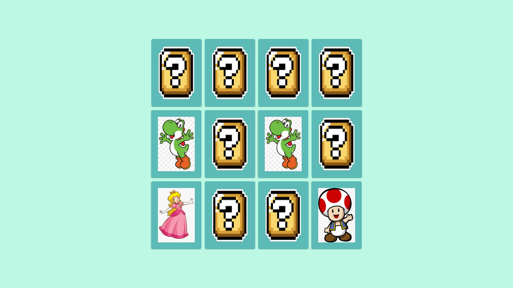

# Memory Game

Project provided by (DIO) Digital Innovation One - Javascript Developer Bootcamp

The Memory Game was the proposal for one of the courses presented in the **HTML Web Developer** bootcamp. Concepts about **CSS and Javascript** are covered in the course and emphasize the Game Development with Javascript.

You can open this game on your [browser](https://rvsriller.github.io/rierMemoryGame/) and see how the first version of this game looks like :video_game: :video_game:

# Tecnologies

- HTML 5
- CSS 3
- Javascript ES 6

